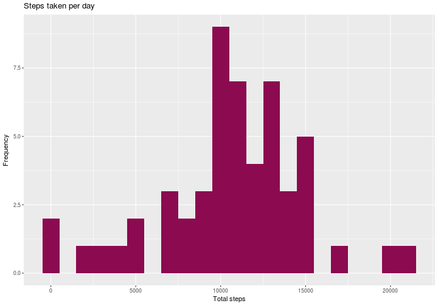
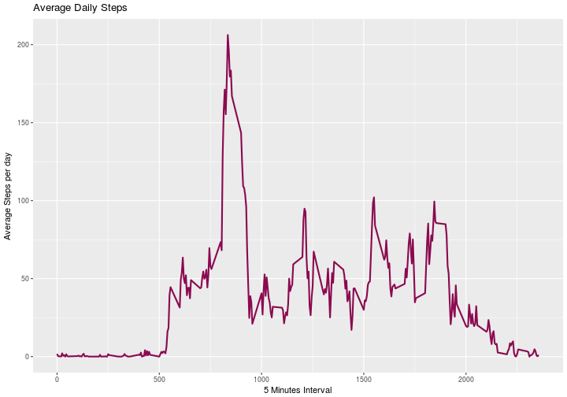
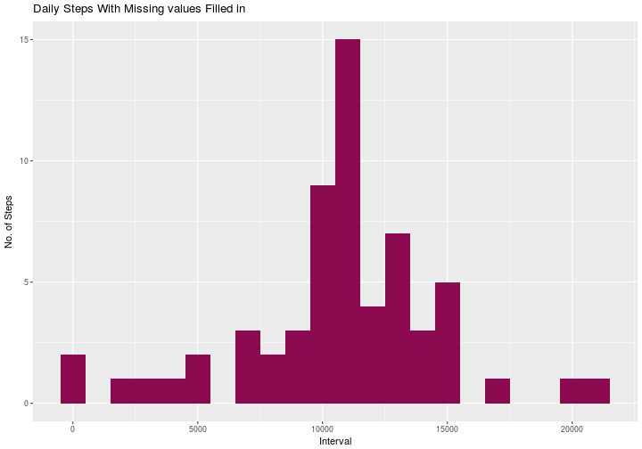
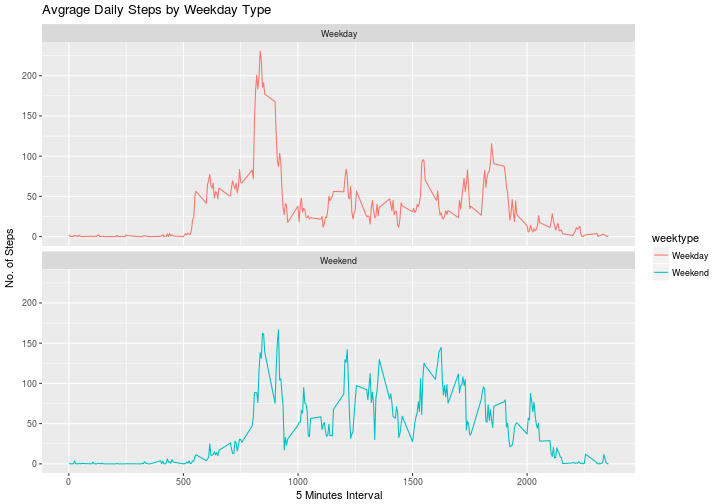

Reproducible Research: Project 1
========================================
This presentation contains reproducible research of activity data analysis.

## Loading and preprocessing the data  

```r
library("ggplot2")
library("dplyr")

if(!file.exists("activity.csv")){
  unzip("activity.zip")
}
activity <- tbl_df(read.csv(file = "activity.csv", header = TRUE, stringsAsFactors = FALSE))
activity
```

```
## # A tibble: 17,568 × 3
##    steps       date interval
##    <int>      <chr>    <int>
## 1     NA 2012-10-01        0
## 2     NA 2012-10-01        5
## 3     NA 2012-10-01       10
## 4     NA 2012-10-01       15
## 5     NA 2012-10-01       20
## 6     NA 2012-10-01       25
## 7     NA 2012-10-01       30
## 8     NA 2012-10-01       35
## 9     NA 2012-10-01       40
## 10    NA 2012-10-01       45
## # ... with 17,558 more rows
```

## What is mean total number of steps taken per day?  

#### 1. Calculation and presentation of total number of steps taken per day

```r
totalSteps <- activity%>%
              filter(!is.na(steps))%>%
              group_by(date)%>%
              summarise(total_steps = sum(steps, na.rm=TRUE))
totalSteps
```

```
## # A tibble: 53 × 2
##          date total_steps
##         <chr>       <int>
## 1  2012-10-02         126
## 2  2012-10-03       11352
## 3  2012-10-04       12116
## 4  2012-10-05       13294
## 5  2012-10-06       15420
## 6  2012-10-07       11015
## 7  2012-10-09       12811
## 8  2012-10-10        9900
## 9  2012-10-11       10304
## 10 2012-10-12       17382
## # ... with 43 more rows
```

#### 2. Histogram of the total number of steps taken each day

```r
ggplot(totalSteps, aes(x = total_steps)) +
       geom_histogram(fill = "deeppink4", binwidth = 1000) +
       labs(title = "Steps taken per day", x = "Total steps", y = "Frequency")
```



#### 3. Calculation and presentation of mean and median steps per day


```r
meanSteps<- mean(totalSteps$total_steps, na.rm=TRUE)
meanSteps
```

```
## [1] 10766.19
```

```r
medianSteps<- median(totalSteps$total_steps, na.rm=TRUE)
medianSteps
```

```
## [1] 10765
```

## What is the average daily activity pattern?  

#### 1. Calculation and presentation of average steps per day in 5 minutes interval

```r
averageSteps <- activity%>%
        group_by(interval)%>%
        filter(!is.na(steps))%>%
        summarise(average_steps = mean(steps, na.rm=TRUE))
averageSteps
```

```
## # A tibble: 288 × 2
##    interval average_steps
##       <int>         <dbl>
## 1         0     1.7169811
## 2         5     0.3396226
## 3        10     0.1320755
## 4        15     0.1509434
## 5        20     0.0754717
## 6        25     2.0943396
## 7        30     0.5283019
## 8        35     0.8679245
## 9        40     0.0000000
## 10       45     1.4716981
## # ... with 278 more rows
```

```r
ggplot(averageSteps, aes(x =interval , y=average_steps)) +
        geom_line(color="deeppink4", size=1) +
        labs(title = "Average Daily Steps", x = "5 Minutes Interval", y = "Average Steps per day")
```



#### 2. Search of 5 minutes intervals where maximum number of average steps present

```r
averageSteps[which.max(averageSteps$average_steps),]
```

```
## # A tibble: 1 × 2
##   interval average_steps
##      <int>         <dbl>
## 1      835      206.1698
```

## Imputing missing values 

#### 1. Calculation of total number of missing values

```r
sum(is.na(activity$steps))
```

```
## [1] 2304
```
#### 2. Imputing missing values using mean for each day
#### 3. Creation of a new dataset that is equal to the original dataset with the missing data filled in

```r
activity2 <- activity
nas <- is.na(activity2$steps)
average_interval <- tapply(activity2$steps, activity2$interval, mean, na.rm=TRUE, simplify = TRUE)
activity2$steps[nas] <- average_interval[as.character(activity2$interval[nas])]
activity2 <- activity2[, c("date", "interval", "steps")]
activity2
```

```
## # A tibble: 17,568 × 3
##          date interval     steps
##         <chr>    <int>     <dbl>
## 1  2012-10-01        0 1.7169811
## 2  2012-10-01        5 0.3396226
## 3  2012-10-01       10 0.1320755
## 4  2012-10-01       15 0.1509434
## 5  2012-10-01       20 0.0754717
## 6  2012-10-01       25 2.0943396
## 7  2012-10-01       30 0.5283019
## 8  2012-10-01       35 0.8679245
## 9  2012-10-01       40 0.0000000
## 10 2012-10-01       45 1.4716981
## # ... with 17,558 more rows
```

#### 4. Creation of histogram of the total number of steps taken each day and calculation of mean and median total number of steps taken daily

```r
totalSteps2<- activity2 %>%
        group_by(date) %>%
        summarise(total_steps = sum(steps, na.rm=TRUE))

ggplot(totalSteps2, aes(x = total_steps)) +
        geom_histogram(fill = "deeppink4", binwidth = 1000) +
        labs(title = "Daily Steps With Missing values Filled in", x = "Interval", y = "No. of Steps")
```



```r
meanSteps2<- mean(totalSteps2$total_steps, na.rm=TRUE)
meanSteps2
```

```
## [1] 10766.19
```

```r
medianSteps2<- median(totalSteps2$total_steps, na.rm=TRUE)
medianSteps2
```

```
## [1] 10766.19
```
```
The impact of imputing missing data with the average number of steps in the same 5-min interval is that both the mean and the median are same.
```

## Are there differences in activity patterns between weekdays and weekends?  

#### 1. Creation of new varibale called WeekType for Weekday & Weekend:

```r
activity2$date <- as.Date(activity2$date)
activity2 <- activity2%>%
            mutate(weektype= ifelse(weekdays(activity2$date)=="Saturday"|
            weekdays(activity2$date)=="Sunday", "Weekend", "Weekday"))
activity2
```

```
## # A tibble: 17,568 × 4
##          date interval     steps weektype
##        <date>    <int>     <dbl>    <chr>
## 1  2012-10-01        0 1.7169811  Weekday
## 2  2012-10-01        5 0.3396226  Weekday
## 3  2012-10-01       10 0.1320755  Weekday
## 4  2012-10-01       15 0.1509434  Weekday
## 5  2012-10-01       20 0.0754717  Weekday
## 6  2012-10-01       25 2.0943396  Weekday
## 7  2012-10-01       30 0.5283019  Weekday
## 8  2012-10-01       35 0.8679245  Weekday
## 9  2012-10-01       40 0.0000000  Weekday
## 10 2012-10-01       45 1.4716981  Weekday
## # ... with 17,558 more rows
```
#### 2. Panel plot of 5 minutes average interval data on weekdays and weekends

```r
averageSteps2<- activity2%>%
        group_by(interval, weektype)%>%
        summarise(average_steps2 = mean(steps, na.rm=TRUE))

plot<- ggplot(averageSteps2, aes(x=interval , y=average_steps2, color=weektype)) +
       geom_line() +
       labs(title ="Avgrage Daily Steps by Weekday Type", x="5 Minutes Interval", y="No. of Steps") +
       facet_wrap(~weektype, ncol = 1, nrow=2)
print(plot)
```


```
In weekdays the test object is more active earlier in the day but the object is more active throughout the weekends.
```
